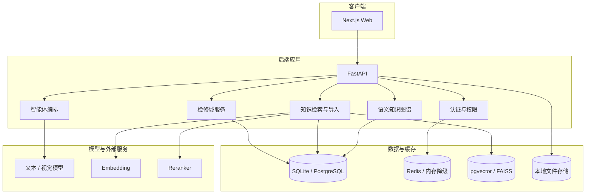

# 系统架构文档

本文档描述一个面向设备检修知识检索与作业辅助的 Web 系统。系统采用前后端分离结构，后端提供检修域 API、知识检索、语义图谱和智能体编排能力，前端提供工作台、知识图谱、任务、工单、监控和设置页面。

## 1. 架构目标

- 支持文本、图片、PDF 等知识输入
- 通过混合检索和语义图谱返回可追溯的知识引用
- 根据检索结果生成诊断任务、处理步骤和工单记录
- 支持登录、验证码、角色权限、审计和系统配置
- 保持本地演示简单，同时允许升级到 PostgreSQL + Redis 部署

## 2. 分层结构

## 3. 后端模块

| 模块 | 说明 |
| ---- | ---- |
| `app/bootstrap` | 应用启动、生命周期、路由注册 |
| `app/core` | 配置、数据库、Redis 客户端等基础设施 |
| `app/modules/maintenance` | 检修域账号、设备、工单、升级、知识条目和系统配置 |
| `app/modules/knowledge` | 知识文档、导入、检索、语义图谱 |
| `app/modules/assistant` | 阶段化智能体编排、执行器注册、条件重规划和修订循环 |
| `app/modules/tasks` | 诊断任务、步骤、历史和导出 |
| `app/modules/cases` | 案例记录、修正、审核和沉淀 |

## 4. 前端模块

| 模块 | 说明 |
| ---- | ---- |
| `frontend/app` | Next.js 路由入口 |
| `features/auth` | 登录、注册、找回密码、验证码 |
| `features/dashboard` | 工作台总览 |
| `features/knowledge` | 知识列表、详情、图谱画布 |
| `features/tasks` | 任务创建、历史、详情、推理链和智能体协作视图 |
| `features/tickets` | 检修工单列表与详情 |
| `features/settings` | 系统配置分区面板 |
| `features/observability` | 监控与告警页面 |
| `shared` | 统一导航、HTTP 客户端、主题和通用组件 |

## 5. 数据与检索

- 关系数据通过 SQLAlchemy + Alembic 管理。
- 本地演示可使用 SQLite；多人联调和长期运行建议使用 PostgreSQL。
- 向量检索默认面向 pgvector，也保留 FAISS 离线降级路径。
- Redis 用于验证码、登录锁定、搜索缓存和后续会话/限流；本地单进程演示可关闭 Redis 使用内存降级。
- 语义图谱包含实体、别名、关系、证据、抽取任务和审核候选，所有图谱结果仍需回溯到知识文档或 chunk。

## 6. 智能体编排

系统对外保持统一的 Agent API，内部通过阶段契约、执行器注册、图状态、条件重规划和修订策略组织执行。这样前端只依赖稳定接口，不直接绑定内部编排图结构。

核心约束：

- 先检索后生成
- 生成内容带引用或明确降级
- 模型失败时返回可解释业务结果，不暴露裸 500
- 关键状态写入任务或工单，便于复盘

## 7. 安全与公开仓库边界

- `.env`、本地数据库、PDF 原件、真实业务数据、截图产物和本地归档不进入公开仓库。
- 登录验证码和失败锁定状态优先进入 Redis。
- 附件访问使用签名 URL 或等价的时效校验。
- 角色权限与关键操作校验在服务端执行，前端隐藏按钮不作为安全边界。
- 对外 HTTP 契约以运行实例 OpenAPI（`/docs`）为准。

## 8. 部署拓扑

### 本地演示

- FastAPI + SQLite
- Redis 可选
- Next.js dev server

### 服务器部署

- Nginx / Caddy 作为反向代理
- FastAPI 应用进程
- PostgreSQL + pgvector
- Redis
- Next.js build 输出或独立 Node 服务

## 9. 验证建议

- 后端：`cd backend && pytest -q`
- 前端：`cd frontend && npm run lint`
- E2E：`cd frontend && npm run test:e2e`
- 接口：启动后访问 `/health`、`/api/auth/captcha`、`/docs`
